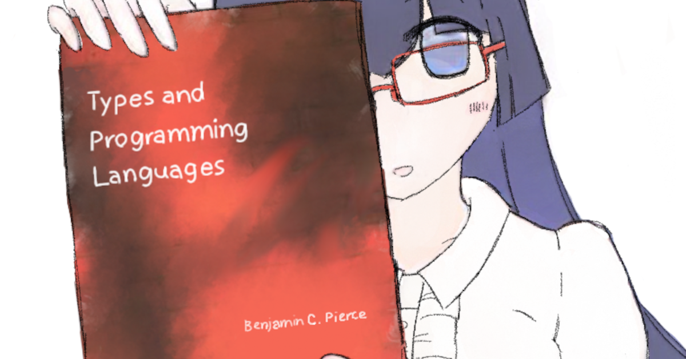

---
  type = "portfolio"
  title = "Portfolio"
  redirect_to = "https://www.cannorin.net/"
---

DJ / Producer. [[bandcamp](https://cannorin.bandcamp.com/) / [soundcloud](https://soundcloud.com/cannorin) / [mixcloud](https://www.mixcloud.com/cannorin/)]

Please contact me on Discord: [cannorin](https://discord.com/users/497190979216867329) (preferred) or Twitter: [@cannorin3](https://twitter.com/cannorin3).

<iframe width="100%" height="120" style="border: 0" src="https://www.mixcloud.com/widget/iframe/?hide_cover=1&light=1&feed=%2Fcannorin%2Fcyberia-mix-20210925-ghostclub%2F"></iframe>

<iframe width="100%" height="120" style="border: 0" src="https://bandcamp.com/EmbeddedPlayer/track=122173286/size=large/bgcol=ffffff/linkcol=0687f5/tracklist=false/artwork=small/transparent=true/" seamless><a href="https://cannorin.bandcamp.com/track/65daysofstatic-supermoon-cannorin-remix">65daysofstatic - Supermoon (cannorin remix) by cannorin</a></iframe>

### DJ Styles and Genres

I usually pick one or two from the following styles:

- *Atmospheric*: DnB, Jungle, Dub Techno, IDM, ...
- *Industrial*: Frenchcore, Schranz, Doomcore, ...
- *Aggressive*: Crossbreed, Breakcore, Speedcore, ...
- *Peak-time Hardcore*: Hardstyle, J-Core, Uptempo, ...

### Recurring Appearances

- The Underground (Organizer Since 2019, Irregular Schedule, VRChat)
- [GHOSTCLUB](https://ゴーストクラブ.コム/) (Resident DJ Since 2020, Irregular Schedule, VRChat)
- system crash (Resident DJ Since 2022, Every 4th Friday, Bhanc, Osaka)

### Guest Appearances

- [SANRIO Virtual Festival in Sanrio Puroland](https://v-fes.sanrio.co.jp/) (VRChat)
  - V-fes 2024, ALT3 RED (Mar 10 2024)
  - V-fes 2023, ALT3 RED/BLUE (Jan 21-22 2023)
  - V-fes (2021), ALT3 RED/BLUE (Dec 11-12 2021)
- [embodiment](https://twitter.com/cannorin3/status/1655598762822365189) (May 19 2023, 夜来香, Osaka)
- [miracle☆sugar - sato♡shin & TohLPeaks Release Party](https://twitter.com/tohlpeaks/status/1570381932365434880) (Oct 30 2022, Namba BEARS, Osaka)
- and more...
  - I typically have about 30 guest appearances per year, most of which are VR parties.

------

Full-stack IT Engineer / Student on Mathematical Logic.

### Skills

- Full-stack Web Development (Frontend, Backend, Database).
- Compiler & Developer Tooling (Parser, Type System, Package Manager, Build System).
- Library Development & Document Writing.
- I am fluent in: C#, F#, OCaml, TypeScript.

### Works

- [nml](https://github.com/cannorin/nml)
- [flxble](https://github.com/cannorin/flxble)
- [FSharp.CommandLine](https://github.com/cannorin/FSharp.CommandLine)
- [ocsigen/ts2ocaml](https://github.com/ocsigen/ts2ocaml)
- [fsprojects/FSharpPlus](https://github.com/fsprojects/FSharpPlus) (maintainer)
- [ionide/Ionide-vim](https://github.com/ionide/Ionide-vim) (maintainer)
- [ゴーストクラブ.コム](https://xn--pckjp4dudxftf.xn--tckwe/) (frontend & backend)
- More on [GitHub](https://github.com/cannorin?tab=repositories&q=&type=&language=&sort=stargazers).

### Field of Study

- Mathematical Logic
  - Modal Logic

### Papers

- Kurahashi, Sato. The finite frame property of some extensions of the pure logic of necessitation. 2023. [arXiv:2305.14762](https://arxiv.org/abs/2305.14762).
